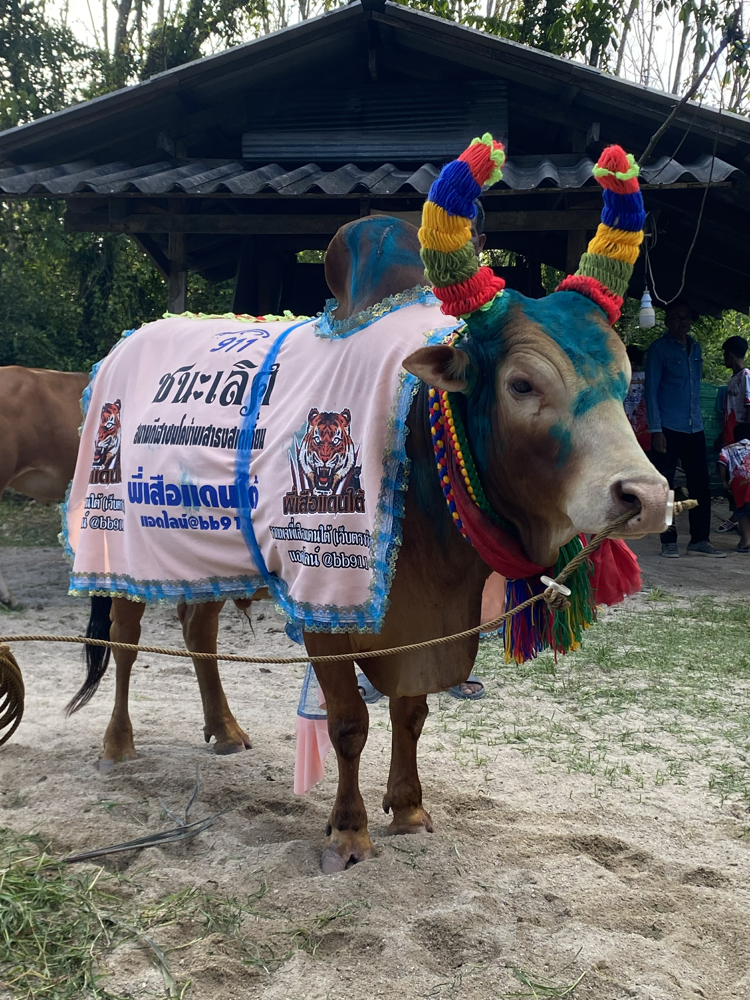

<!DOCTYPE html>
<html lang="th">
<head>
<meta charset="UTF-8">
<meta name="viewport" content="width=device-width, initial-scale=1.0">
<title>ประวัติวัวชน</title>

</head>
<body>

<header>
    <h1>โคดุกด้าง แชมป์นักสู้</h1>
    
ประวัติและสถิติการชน

</header>

    

    

        <h2>ข้อมูลทั่วไป</h2>
        
<strong>ชื่อ:</strong> ใส่ชื่อวัวชน

        
<strong>เจ้าของ:</strong> ใส่ชื่อเจ้าของ

        
<strong>ค่าย:</strong> ใส่ชื่อค่าย

        
<strong>อายุ:</strong> ใส่อายุ

        
<strong>สี:</strong> ใส่สีวัว

        
<strong>สายพันธุ์:</strong> ใส่สายพันธุ์

    

    

        <h2>ประวัติ</h2>
        

            ใส่ประวัติวัวชนของคุณที่นี่
            เช่น แหล่งกำเนิด การฝึกซ้อม จุดเด่น
            และเรื่องราวต่างๆ
        

    

    

        <h2>สถิติการชน</h2>

        <table>
            <tr>
                <th>ครั้งที่</th>
                <th>วันที่</th>
                <th>คู่ชน</th>
                <th>สนาม</th>
                <th>ผลการแข่งขัน</th>
            </tr>

            <tr>
                <td>1</td>
                <td>00/00/0000</td>
                <td>ชื่อคู่ชน</td>
                <td>สนามชนโค</td>
                <td>ชนะ</td>
            </tr>

            <tr>
                <td>2</td>
                <td>00/00/0000</td>
                <td>ชื่อคู่ชน</td>
                <td>สนามชนโค</td>
                <td>ชนะ</td>
            </tr>

        </table>
    

    

        <h2>ผลงาน</h2>
        <ul>
            <li>แชมป์รายการ ...</li>
            <li>ชนะติดต่อกัน ... ครั้ง</li>
            <li>รางวัลพิเศษ ...</li>
        </ul>
    

<footer>
    © 2026 เว็บไซต์ประวัติวัวชน
</footer>

</body>
</html>
